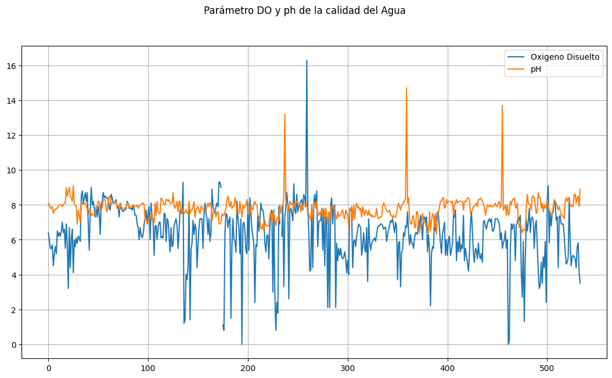
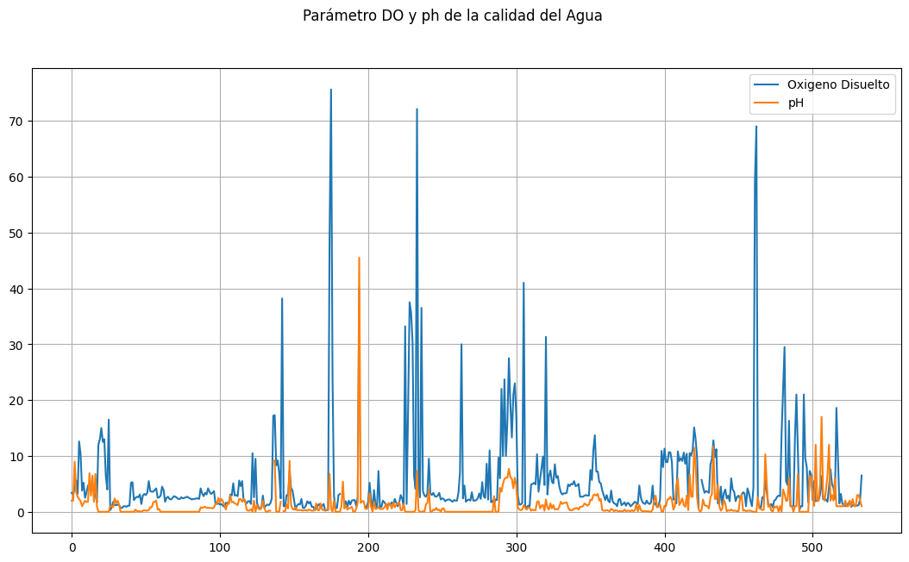
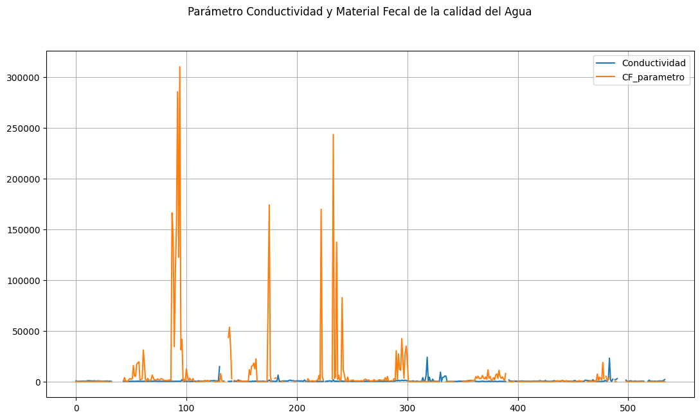

# Taller 1 – Predicción de la Calidad del Agua en la India con PySpark MLlib

**Autor:** Natalia Echeverry Salcedo  
**Fecha de Inicio:** 28/07/2025  
**Fecha actual:** 10/08/2025  

## Problemática
El tratamiento del agua es indispensable para garantizar su pureza y calidad.  
Uno de los aspectos clave es aplicar conceptos de **procesamiento de datos en alto volumen** para abordar problemas que afectan la salud pública.  
Este ejemplo tiene como propósito presentar una metodología para aplicar procesamiento masivo de datos con el fin de diagnosticar y predecir la calidad del agua en la India.

## Objetivo
Implementar modelos de predicción utilizando la biblioteca de aprendizaje automático **MLlib** de PySpark, con el fin de explorar y aplicar técnicas de IA en entornos de procesamiento con alto volumen de datos.

## Metodología
1. **Importación de datos** desde IDRIVE (en diferentes formatos).
2. **Preprocesamiento y limpieza**: manejo de valores nulos, cambios de tipo de datos, EDA, medidas estadísticas.
3. **Entrenamiento de modelos**: Regresión Lineal (MLlib) y tensores (Keras) para predecir la calidad del agua.
4. **Evaluación de modelos**: métricas de rendimiento como precisión (*precision*), exactitud (*accuracy*), recall y F1 Score.
5. **Referencia:** [Water Quality Parameters – IntechOpen](https://www.intechopen.com/chapters/69568)

---

##**1. Importación de bibliotecas**


```python
import os
import pandas as pd
import numpy as np
import matplotlib.pyplot as plt
import seaborn as sns
import geopandas as gpd

#Bibliotecas especializadas
from pylab import *


#Bibliotecas de Contexrp PySpark
from pyspark import SparkContext, SparkConf
from pyspark.sql import SparkSession, SQLContext

from pyspark.sql.types import *
import pyspark.sql.functions as F #Acceso a todas las funciones

contexto = SparkContext.getOrCreate(SparkConf().setMaster("local[*]"))

from pyspark.sql import SparkSession
##Se crea la a¿sesión para el tratamiento de alto volúmen de datos: calidad del agua
spark = SparkSession.builder.getOrCreate()

context =SQLContext(contexto)

from pyspark.ml.evaluation import RegressionEvaluator
```

```
/usr/local/lib/python3.11/dist-packages/pyspark/sql/context.py:113: FutureWarning: Deprecated in 3.0.0. Use SparkSession.builder.getOrCreate() instead.
  warnings.warn(
```

##**2. Carga de datos desde el IDRIVE**


```python
#Se conecta con IDRIVE de google
from google.colab import drive
drive.mount("/content/drive/")
```

```
Mounted at /content/drive/
```

```python
rutaCSV = "/content/drive/MyDrive/Colab Notebooks/CalidadAgua/waterquality.csv"
rutaMapa = "/content/drive/MyDrive/Colab Notebooks/CalidadAgua/Indian_States.shp"
```

```python
os.environ['SHAPE_RESTOR_SHX'] = 'YES'
```

```python
#Se empieza a cargar los
df00 = spark.read.csv(rutaCSV, header=True, inferSchema=True)
#se requiere observar los primeros 5 datos cabecera
df00.show(5)
```

```
+------------+--------------------+-----------+----+---+---+------------+---+-------------------+--------------+--------------+
|STATION CODE|           LOCATIONS|      STATE|TEMP| DO| pH|CONDUCTIVITY|BOD|NITRATE_N_NITRITE_N|FECAL_COLIFORM|TOTAL_COLIFORM|
+------------+--------------------+-----------+----+---+---+------------+---+-------------------+--------------+--------------+
|        1312|GODAVARI AT JAYAK...|MAHARASHTRA|29.2|6.4|8.1|         735|3.4|                  2|             3|            73|
|        2177|GODAVARI RIVER NE...|MAHARASHTRA|24.5|  6|8.0|         270|3.1|                  2|            72|           182|
|        2182|GODAVARI RIVER AT...|MAHARASHTRA|25.8|5.5|7.8|         355|4.2|                  9|            59|           133|
|        2179|GODAVARI RIVER AT...|MAHARASHTRA|24.8|5.5|7.8|         371|5.6|               3.55|            90|           283|
|        2183|GODAVARI RIVER AT...|MAHARASHTRA|25.7|5.7|7.9|         294|3.2|               2.69|            45|           132|
+------------+--------------------+-----------+----+---+---+------------+---+-------------------+--------------+--------------+
only showing top 5 rows
```

##**3. Análisis y Preparación de Datos**
Se presentan datos en formato CSV con los diferentes parámetros de los rios de la India. Cada paramentro es el promedio de los valores medidos en un período de tiempo. Los datos han sido extraidos de la web oficial de la India (RiverIndia)

-Tipo de datos: coherencia de tipo de datos, transformación.

-Columnas: conocimiento de las columnas, eliminación.

-Analisis de datos nulos o imposibles: conocimiento


```python
#Conocimiento de las columnas
df00.columns
```

```
['STATION CODE',
 'LOCATIONS',
 'STATE',
 'TEMP',
 'DO',
 'pH',
 'CONDUCTIVITY',
 'BOD',
 'NITRATE_N_NITRITE_N',
 'FECAL_COLIFORM',
 'TOTAL_COLIFORM']
```


* STATION CODE: Código de estación de medida
* LOCATIONS
* STATE
* TEMP
* DO
* pH
* CONDUCTIVITY
* BOD
* NITRATE_N_NITRITE_N
* FECAL_COLIFORM: Promedio de bacterias coliformes: excresiones
* TOTAL_COLIFORM: Se eliminara pues no aporta al estuido de prediccion de calidad del agua


**Se presentan las estadísticas de datos a continuación:**


```python
for valor in df00.columns:
  df00.describe([valor]).show()
```

```
+-------+-----------------+
|summary|     STATION CODE|
+-------+-----------------+
|  count|              534|
|   mean|2052.516853932584|
| stddev|755.2178560086894|
|    min|               11|
|    max|             3330|
+-------+-----------------+

+-------+-------------------+
|summary|          LOCATIONS|
+-------+-------------------+
|  count|                534|
|   mean|               NULL|
| stddev|               NULL|
|    min|          AHMEDABAD|
|    max|ZUARI AT PANCHAWADI|
+-------+-------------------+

+-------+--------------+
|summary|         STATE|
+-------+--------------+
|  count|           534|
|   mean|          NULL|
| stddev|          NULL|
|    min|ANDHRA PRADESH|
|    max|   WEST BENGAL|
+-------+--------------+

+-------+------------------+
|summary|              TEMP|
+-------+------------------+
|  count|               534|
|   mean|25.241398865784515|
| stddev|3.4480130875026624|
|    min|              10.5|
|    max|                NA|
+-------+------------------+

+-------+-----------------+
|summary|               DO|
+-------+-----------------+
|  count|              534|
|   mean|6.389812030075193|
| stddev|1.622861728733986|
|    min|                0|
|    max|               NA|
+-------+-----------------+

+-------+------------------+
|summary|                pH|
+-------+------------------+
|  count|               534|
|   mean|  7.79812734082397|
| stddev|0.6499503911518124|
|    min|               6.3|
|    max|              14.7|
+-------+------------------+

+-------+------------------+
|summary|      CONDUCTIVITY|
+-------+------------------+
|  count|               534|
|   mean| 684.9761904761905|
| stddev|1769.3297602834873|
|    min|               100|
|    max|                NA|
+-------+------------------+

+-------+-----------------+
|summary|              BOD|
+-------+-----------------+
|  count|              534|
|   mean|5.339772727272726|
| stddev|8.500503922190218|
|    min|              0.2|
|    max|               NA|
+-------+-----------------+

+-------+-------------------+
|summary|NITRATE_N_NITRITE_N|
+-------+-------------------+
|  count|                534|
|   mean| 1.3785714285714301|
| stddev|  2.803947753154703|
|    min|                  0|
|    max|                 NA|
+-------+-------------------+

+-------+-----------------+
|summary|   FECAL_COLIFORM|
+-------+-----------------+
|  count|              534|
|   mean|7384.170353982301|
| stddev|30714.05963523712|
|    min|                0|
|    max|               NA|
+-------+-----------------+

+-------+------------------+
|summary|    TOTAL_COLIFORM|
+-------+------------------+
|  count|               534|
|   mean|124396.96767676767|
| stddev|1458407.8189939584|
|    min|                 1|
|    max|                NA|
+-------+------------------+
```

##**Visualización de los Datos**


```python
#Se cres una tabla de

df00.select([F.count(F.when(F.isnan(c) | F.col(c).isNull(), c)).alias(c) for c in df00.columns]).show()
```

```
+------------+---------+-----+----+---+---+------------+---+-------------------+--------------+--------------+
|STATION CODE|LOCATIONS|STATE|TEMP| DO| pH|CONDUCTIVITY|BOD|NITRATE_N_NITRITE_N|FECAL_COLIFORM|TOTAL_COLIFORM|
+------------+---------+-----+----+---+---+------------+---+-------------------+--------------+--------------+
|           0|        0|    0|   0|  0|  0|           0|  0|                  0|             0|             0|
+------------+---------+-----+----+---+---+------------+---+-------------------+--------------+--------------+
```


*   Se observa que no hay datos nulos o imposibles
*   Se procede a graficar cada una de las dimensiones


```python
#Se crea una vista para ser usada en las visualizaciones

df00.createOrReplaceTempView("df00_sql")
```

```python
df01 = spark.sql('''Select * from df00_sql where TEMP is not null and
            DO is not null and
            pH is not null and
            CONDUCTIVITY is not null and
            BOD is not null and
            NITRATE_N_NITRITE_N is not null and
            FECAL_COLIFORM is not null''')
```

```python
#Se verifica la Cantidad de Valores Nulos o Imposibles

df01.select([F.count(F.when(F.isnan(c) | F.col(c).isNull(), c)).alias(c) for c in df01.columns]).show()
```

```
+------------+---------+-----+----+---+---+------------+---+-------------------+--------------+--------------+
|STATION CODE|LOCATIONS|STATE|TEMP| DO| pH|CONDUCTIVITY|BOD|NITRATE_N_NITRITE_N|FECAL_COLIFORM|TOTAL_COLIFORM|
+------------+---------+-----+----+---+---+------------+---+-------------------+--------------+--------------+
|           0|        0|    0|   0|  0|  0|           0|  0|                  0|             0|             0|
+------------+---------+-----+----+---+---+------------+---+-------------------+--------------+--------------+
```

**Tratamiento de datos**


```python
df00.dtypes
```

```
[('STATION CODE', 'int'),
 ('LOCATIONS', 'string'),
 ('STATE', 'string'),
 ('TEMP', 'string'),
 ('DO', 'string'),
 ('pH', 'double'),
 ('CONDUCTIVITY', 'string'),
 ('BOD', 'string'),
 ('NITRATE_N_NITRITE_N', 'string'),
 ('FECAL_COLIFORM', 'string'),
 ('TOTAL_COLIFORM', 'string')]
```

```python
#Se procede a cambiar los tipos de datos
df00=df00.withColumn('TEMP', df00['TEMP'].cast(FloatType()))
df00=df00.withColumn('pH', df00['pH'].cast(FloatType()))
df00=df00.withColumn('DO', df00['DO'].cast(FloatType()))
df00=df00.withColumn('CONDUCTIVITY', df00['CONDUCTIVITY'].cast(FloatType()))
df00=df00.withColumn('NITRATE_N_NITRITE_N', df00['NITRATE_N_NITRITE_N'].cast(FloatType()))
df00=df00.withColumn('FECAL_COLIFORM', df00['FECAL_COLIFORM'].cast(FloatType()))
df00=df00.withColumn('BOD', df00['BOD'].cast(FloatType()))
df00.dtypes
```

```
[('STATION CODE', 'int'),
 ('LOCATIONS', 'string'),
 ('STATE', 'string'),
 ('TEMP', 'float'),
 ('DO', 'float'),
 ('pH', 'float'),
 ('CONDUCTIVITY', 'float'),
 ('BOD', 'float'),
 ('NITRATE_N_NITRITE_N', 'float'),
 ('FECAL_COLIFORM', 'float'),
 ('TOTAL_COLIFORM', 'string')]
```

```python
#Se elimina la columna de TOTAL_COLIFORM
df01 = df00.drop('TOTAL_COLIFORM')
df01.columns
```

```
['STATION CODE',
 'LOCATIONS',
 'STATE',
 'TEMP',
 'DO',
 'pH',
 'CONDUCTIVITY',
 'BOD',
 'NITRATE_N_NITRITE_N',
 'FECAL_COLIFORM']
```

**Creación de Tablaas para Visualizar los datos**


*   Se hace uso de la función LAMBDA para hacer el tratamiento y limpieza de los datos


```python
df01.createOrReplaceTempView("df01_sql")

### Se crea una consulta por cada parametro
do_parametro = spark.sql("Select DO from df01_sql")

### rdd : Resilient Distributed Dataset :: son los datos pero ya de manera distribuida

### Se hace una consulta para crear el vector de la tabla por cada parametro
do_parametro= do_parametro.rdd.map(lambda fila: fila.DO).collect()

### con PH
PH_parametro = spark.sql("Select pH from df01_sql")
PH_parametro= PH_parametro.rdd.map(lambda fila: fila.pH).collect()

### con CONDUCTIVITY (COND)
COND_parametro = spark.sql("Select CONDUCTIVITY from df01_sql")
COND_parametro= COND_parametro.rdd.map(lambda fila: fila.CONDUCTIVITY).collect()

### con BOD
BOD_parametro = spark.sql("Select BOD from df01_sql")
BOD_parametro= BOD_parametro.rdd.map(lambda fila: fila.BOD).collect()

### con NN
NN_parametro = spark.sql("Select NITRATE_N_NITRITE_N from df01_sql")
NN_parametro= NN_parametro.rdd.map(lambda fila: fila.NITRATE_N_NITRITE_N).collect()

### con CF
FC_parametro = spark.sql("Select FECAL_COLIFORM from df01_sql")
FC_parametro= FC_parametro.rdd.map(lambda fila: fila.FECAL_COLIFORM).collect()
```

```python
# Grafica de los parametros para conocer sus caracteristicas
tam = len(do_parametro)
fig, ax1 = plt.subplots(num=None,  figsize=(13,7), facecolor='w', edgecolor='k')
ax1.plot(range(0, tam), do_parametro, label='Oxigeno Disuelto')
ax1.plot(range(0, tam), PH_parametro, label='pH')
fig.suptitle('Parámetro DO y ph de la calidad del Agua')
legend=ax1.legend()
plt.grid()
plt.show()
```

```
<Figure size 1300x700 with 1 Axes>
```


```python
# Grafica de los parametros para conocer sus caracteristicas
tam = len(do_parametro)
fig, ax1 = plt.subplots(num=None,  figsize=(13,7), facecolor='w', edgecolor='k')
ax1.plot(range(0, tam), BOD_parametro, label='Oxigeno Disuelto')
ax1.plot(range(0, tam), NN_parametro, label='pH')
fig.suptitle('Parámetro DO y ph de la calidad del Agua')
legend=ax1.legend()
plt.grid()
plt.show()
```

```
<Figure size 1300x700 with 1 Axes>
```


```python
# Grafica de los parametros para conocer sus caracteristicas
tam = len(do_parametro)
fig, ax1 = plt.subplots(num=None,  figsize=(13,7), facecolor='w', edgecolor='k')
ax1.plot(range(0, tam), COND_parametro, label='Conductividad')
ax1.plot(range(0, tam), FC_parametro, label='CF_parametro')
fig.suptitle('Parámetro Conductividad y Material Fecal de la calidad del Agua')
legend=ax1.legend()
plt.grid()
plt.show()
```

```
<Figure size 1300x700 with 1 Axes>
```


```python
#Se requiere hacer una funcion definida por el usuario: que permita definir el rango de la calidad del agua segun el PH
#Se crea una columna para los rangos del parametro

df02 = df01.withColumn("qrPH", F.when((df01.pH>=7)& (df01.pH<=8.5), 100).
                                when(((df01.pH>=6.8) & (df01.pH<6.9)) | ((df01.pH>8.5) & (df01.pH<8.6)), 80).
                                when(((df01.pH>=6.7) & (df01.pH<6.8)) | ((df01.pH>=8.6) & (df01.pH<8.8)), 60).
                                when(((df01.pH>=6.5) & (df01.pH<6.7)) | ((df01.pH>=8.8) & (df01.pH<9.0)), 40).otherwise(0))
```

```python
#Funcion definida por el usuario para definir el rando de la calidad del agua segun Do
df02 = df02.withColumn("qrDO", F.when((df01.DO>=6), 100).
                      when((df01.DO>=5.1) & (df01.DO<6.0),80).
                      when((df01.DO>=4.1) & (df01.DO<5.0), 60).
                      when((df01.DO>=3.0) & (df01.DO<=4.0), 40).otherwise(0))
```

```python
df02 = df01.withColumn("qrCOND", F.when((df01.CONDUCTIVITY>=0.0) & (df01.CONDUCTIVITY<=75.0), 100).
                                when((df01.CONDUCTIVITY>75.0) & (df01.CONDUCTIVITY<=105.0), 80).
                                when((df01.CONDUCTIVITY>150.0) & (df01.CONDUCTIVITY<=225.0), 60).
                                when((df01.CONDUCTIVITY>225.0) & (df01.CONDUCTIVITY<=300.0), 40).otherwise(0))
```

```python
df02 = df01.withColumn("qrBOD", F.when((df01.BOD>=0.0) & (df01.BOD<3.0), 100).
                                when((df01.BOD>=3.0) & (df01.BOD<6.0), 80).
                                when((df01.BOD>=6.0) & (df01.BOD<80.0), 60).
                                when((df01.BOD>=80.0) & (df01.BOD<125.0), 40).otherwise(0))
```
